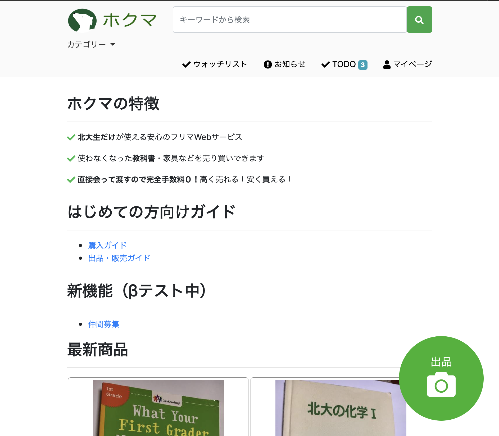
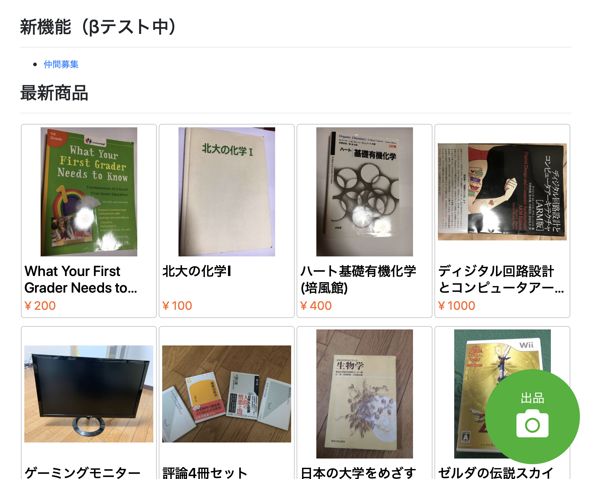
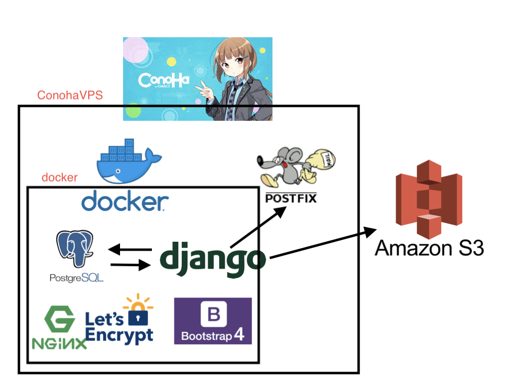

# ホクマ

- 北大生だけで安全な売り買いができるフリマWebサービス
- 直接手渡しで渡すスタイルなので、運命の出会いも・・・？
- URL: [https://hufurima.com/](https://hufurima.com/)

## ScreenShot 

## 技術構成図

## できること
- [出品](https://hufurima.com/guide/sell)
- [購入](https://hufurima.com/guide/buy)
- チャット
- [仲間募集（β: 1月~）](https://hufurima.com/offer/latest)

## リリース予定
- 2018年5月末: プロトタイプ版のサークル内公開（5/21 完了）
- 2018年7月:   α版のサークル内公開（機能・見た目の完成）
- 2018年8月:   β版のサークル内公開（運用方法の確定）
- 2018年9月:   リリース予定
- 2018年10月1日: リリース完了

## 開発環境
- Python 3.6.2
- Django 2.1.5

## 開発に参加する(start contribution)
[このドキュメント](docs/開発に参加する.md)を読んで、ぜひ開発チームに加わってほしいです！

以下のメリットがあります

- Webアプリ開発の基礎が身に付く
  - サーバーサイドの定番: MTV(like MVC)アーキテクチャ
  - ORMを用いた基本的なDB操作
  - 基本的なHTML, CSS, 古典的なJavascript(JSには期待しないで)
- Githubの使い方が身に付く(issue, pull requestの基本)
  - 大まかに[この記事](https://qiita.com/awakia/items/c571e93e96a1ec28044f)に基づいています
- コードレビューが受けられる

このレポジトリにコントリビュートする（手伝う）ためには、**DjangoとBootstrap4の基礎知識があればOKです！**

DjangoとBootstrap4の基礎といっても、ほとんど知識は必要ありません。公式のチュートリアルをコピペでいいので一周しましょう。

- Bootstrap4: [https://getbootstrap.com/docs/4.2/getting-started/introduction/](https://getbootstrap.com/docs/4.2/getting-started/introduction/)
- Django: [https://docs.djangoproject.com/ja/2.1/intro/install/](https://docs.djangoproject.com/ja/2.1/intro/install/)

## contributors
- @TetsuFe
- @horikaw
- @Tatmius
- @Gracer828 

## メイン開発チーム
- HUITCLUB: [Twitter](https://twitter.com/huitclub)

## SNS
- [Twitter](https://twitter.com/hufurima)
- [マシュマロ](https://marshmallow-qa.com/hufurima?utm_medium=url_text&utm_source=promotion)
