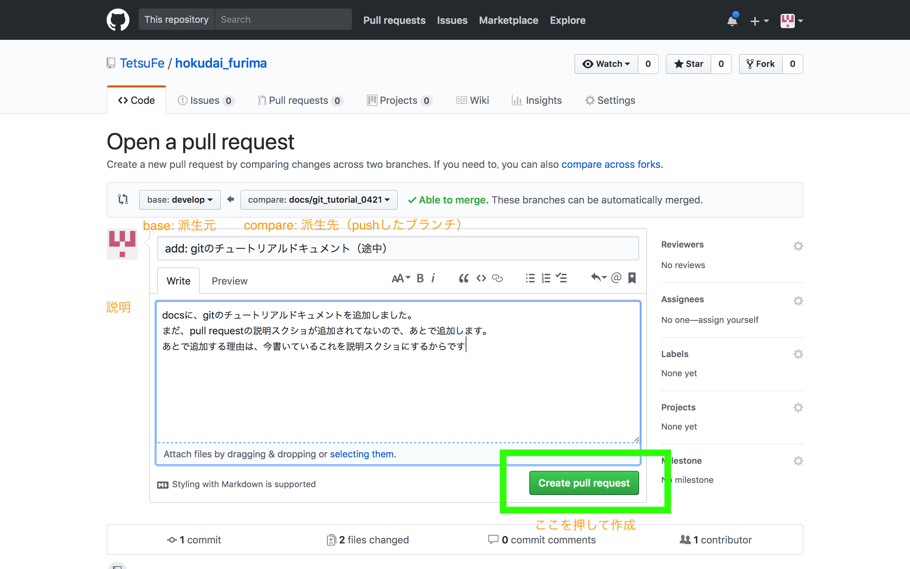

# gitとgithubを知る・使う

## 必ず守ってほしいこと
gitのコマンドを実行すると、英語のメッセージが出る。できれば最初のうちは全部に目を通して英語を理解して、問題が起こっていそうならそのメッセージをコピペしてgoogle検索 or 誰かに質問するようにしてほしい。

## 目次
- [1. gitとは](#chap1)
    - なぜgitを使うのか・メリット
    - githubとは 
    - gitの基本コマンドを知る
- [2. gitを使ってみる](#chap2)
    - gitの初期設定
    - gitの流れを体験する
- [3. 困ったとき・迷ったとき](#chap3)
    - どれをコミットしたか確認する
    - どのブランチから派生したか確認する

## <a id="chap1">gitとは</a>
gitとは、ある「レポジトリ（＝ディレクトリ）」のファイルの変更履歴を記録するコマンドである

## なぜgitを使うのか・メリット
- 変更を元に戻せる
- 複数人で同じところを変更（＝コンフリクト）した時に検知してくれる
- 「ブランチ」に分けて、並行して細かい部分毎にファイルの差分を記録できる
    - 例：サイトの見た目と中身の処理を並行してその日の気分で進めたい
        - ブランチがない場合：「サイトの見た目」だけやっぱり前に戻したい！でも問題ない「中身の処理も戻さないといけない
        - ブランチがある場合：「サイトの見た目」のブランチだけまずマージ（ソースコードの結合）して、「中身の処理」のブランチはコンフリクトを解消してからマージ

（実際には、ブランチを分けていなくても、コミットを別々にしていればコミット毎に元に戻すことができる。けどもそれは面倒。やっていけばわかる）

## githubとは
githubは以下のような特徴を持ったサイト
- gitの差分記録を見やすく表示
- オンライン上に差分記録を保存しておけるストレージ
- issueやpull requestといった機能で、複数人で課題管理をしたり、チャットしたりして円滑に複数人開発ができる


## 2. gitの流れを体験する
- レポジトリ作成もしくはクローン
- ブランチ作成
- ファイルの編集
- コミット
- push
- pull request
- マージ

という流れになる。

### gitの初期設定

- gitのインストール（済んでいるとする。コマンドライン（ターミナル・コマンドプロンプト）で`git`と打ってエラーが出なかったらインストールされている）
- gitの署名（コミットするときの名義。誰が編集したかわかるようにする）
- ショートカット
- 諸設定

### gitの署名
以下の２行は、自分の設定によって変わるので、単純にコピペしないように

`$ git config --global user.name "ユーザ名" # (githubのユーザ名。""で囲む)`

`$ git config --global user.email githubのメアド # ""で囲まない`

### 諸設定
`$ git config --global push.default matching  # git push としたとき、ローカルとリモートで同じ名前のブランチがあったら、全て push する。`

### ショートカット
`$ git config --global alias.co checkout #任意。checkoutをcoと短縮系で使えるようになる  `


### 2-1. レポジトリ作成もしくはクローン
「北大フリマ」の場合は、すでにレポジトリはリモートに作成されているので、

`$ #git init`

はしなくてよい。（コピペ防止のため、コメントアウトしてある）

代わりに、「クローン」する

`$ git clone https://github.com/TetsuFe/hokudai_furima.git # git clone リポジトリURL`

クローンしたら、カレントディレクトリに、`hokudai_furima`というディレクトリができるので、

`$ cd hokudai_furima`

などして移動する。

### 2-2. リモートからローカルにブランチをダウンロード
「北大フリマ」の場合は、
リモートに

- master
- develop

の二つ（かそれ以上）のブランチがあるが、クローンしたばかりの今の時点では、masterしか表示されない。

`$ git branch # 全てのローカルにあるブランチを表示`

```
* master
```

そこで、リモートにある`develop`もローカルにもってくるために以下のコマンドを実行

`$ git checkout -b develop origin/develop`

すると、

`$ git branch # 全てのローカルにあるブランチを表示`

```
* develop
master
```

(`*`が今いるブランチ)

developブランチの取得と、developブランチへの移動が完了したことが確認できた。

### 補足：他のリモートにあるブランチを持ってきたいとき

`$ git branch -r`

とすると、リモートのブランチの一覧が出てくる。

```
  origin/HEAD -> origin/master
  origin/develop
  origin/master
```

ここからクローンしたいブランチを選んで、

`$ git checkout -b ブランチ名 origin/ブランチ名`

のようにすれば、追加で他のブランチもクローンできる。

（**補足終わり**）

### 2-3. ブランチ間の移動・派生先ブランチの作成
`$ git checkout -b ブランチ名(追加する機能などの名前) # $ ブランチ名の例：remove/unused_email_templates ）`

ブランチは、まず`$git init`した時点で、デフォルトの「master」ブランチが作成され、

- master
    - develop（masterブランチから派生）
        - ブランチA（developブランチから派生）
        - ブランチB（developブランチから派生）

という形で作成していく。

「北大フリマ」の場合では、今までの操作で

- master
    - develop
        - さっき追加したブランチ

という関係が作られているはず。

`$ git branch`  

```
  develop
* さっき追加したブランチ
  master
```

となっていればOK。

### 2-4. ファイルの編集
普通にコーディングする。（ブランチ名に沿った内容にとどめておくことが望ましい）

編集したファイルの確認

`$ git status # メッセージの意味がわからなかったらググる！`

### 2-5. addとコミット
`$ git add ファイル名 # もしくは、git add -A など`

`$ git commit -m "コミットメッセージ" # e.g: git commit -m "add: oo機能を追加"`

コミットできているかの確認

`$ git status # メッセージの意味がわからなかったらググる！`

### 2-6. プッシュ
pushは、ローカル（自分のPC）のコミットやブランチをリモートのレポジトリに反映する操作です。

初回のみ、ローカルとリモートのレポジトリを紐づける以下の一行を実行します


`#cloneした場合はやらなくて良い $ git remote add origin レポジトリURL # ブラウザのURLバーのURLとは別なので注意！`

`$ git push origin 現在のブランチ名`

ここで注意すべき点は、次の「pull requst」を見越してブランチをpushする必要があるということです。

「pull request」では、

- 「派生元ブランチA（派生する前のブランチ）」
- 「派生先ブランチB（＝pushするブランチ）」

のセットで行います。

なので、派生元のブランチAがあることを確認して、

`$ git push origin 派生先のブランチB`

としましょう。

逆によくない例としては、「派生元ブランチA」がリモートにない場合（２回以上checkoutしてブランチを２階層以上先まで派生させたとき）、「pull request」が正常にできないことがある

### 2-7. pull request（次の「マージ」が先に来る場合もある）
github上で、pull requestを送る。
派生元のブランチと、pushした変更後のブランチで違いを見て、問題がないかサイト上で確認ができる。

- base: 派生元ブランチA
- compare: pushしたブランチ（派生先ブランチB）

という形でpull requestを送る



### 2-7-1. 人のpull requestをテストする
- 新しいブランチの存在確認

`$ git fetch`

- リモートのブランチ一覧を調べる

`$ git branch -r`

- ブランチをローカルにもってくる

`$ git checkout -b ブランチ名(追加する機能などの名前) # $ ブランチ名の例：remove/unused_email_templates ）`


後は自分の環境で、pull requestされたコードが正しいかテストする

### 2-8. マージ
githubのpull request上でマージ

もしくは、

`$ git merge 今のブランチにマージしたい他のブランチ名`


### 2-9. リモートのdevelopやmasterの更新をローカルに反映する
2-7-1では、他人がプッシュしたブランチをローカルにもってくる方法を説明した。
この場合だと、単にローカルにもってくる（＝実質、新規作成）だけでテストすることができる。

しかし、developやmasterなどの場合、自分のローカルレポジトリにすでにあるので、

- リモートのブランチをローカルにコピー（git fetch）
- リモートのブランチとローカルのブランチを合体させる（git merge）

この２つの手順を行う必要がある。

#### 手順
リモートのブランチをローカルにコピー

`$ git fetch`

合体前のローカルブランチにcheckoutする

`$ git checkout *** # 例 git checkout develop`

リモートブランチをローカルブランチにマージする

`$ git merge origin/*** # 例 git merge origin/develop`

注意点
- `***`の部分は同じ名前にする
- リモートから取ってきたブランチは、全て`origin/***`というように"origin"がブランチ名の前につく


## <a id="chap3">3. 困ったとき・迷ったとき</a>
困ったときや、どうなっているかわからなくなったときに確認する方法について説明します

### 3.1 どのファイルをadd・コミットしたか確認する
使い所
- `$ git commit -m "メッセージ"`する前に、どのファイルをaddしたか確認したい
- `$ git push origin ブランチ名`する前にどのファイルをコミットしたか確認したい

以下のコマンドを実行

`$ git status`

```
On branch docs/git_tutorial_0427
Changes not staged for commit:
  (use "git add <file>..." to update what will be committed)
  (use "git checkout -- <file>..." to discard changes in working directory)

        modified:  test.txt 

Untracked files:
  (use "git add <file>..." to include in what will be committed)

        hello.txt

no changes added to commit (use "git add" and/or "git commit -a")
```

ここで重要な部分は、

```
modified: test.txt 
```

これは、test.txtがadd（track）されているがコミットされていないことを示す

また、

```
Untracked files:
  (use "git add <file>..." to include in what will be committed)

        hello.txt
```

は、hello.txtがadd(track)されておらず、コミットされていないことを示す

### 3.2 コミットを取り消したい

### 3.2.1 一つ前のコミットを取り消す

`$ git reset —soft HEAD^`

ファイルの変更はそのままで、コミット記録だけ取り消すことができる

### 3.2.2 二つ以上コミットを取り消す

`$ git log`

これを実行すると、以下のように出てくる。例えば、３つ前のコミットIDはc9c3403d3af5b22ffdeaf61922a3cfa13f0070d2ということになる。
```
commit b8df01230ea945a56745f618c50f4f492f97092b (HEAD -> docs/git_tutorial_0427, origin/develop, develop)
Merge: 1b5f35a da6b6a2
Author: Tetsu <tetsubeg1ner27@gmail.com>
Date:   Sat Apr 21 18:29:50 2018 +0900

    Merge pull request #2 from TetsuFe/docs/git_tutorial_0421
    
    add: gitのチュートリアルドキュメント（途中）

commit da6b6a2cb5a6aec74acf88ffaafc334fb98cff0e (origin/docs/git_tutorial_0421, docs/git_tutorial_0421)
Author: TetsuFe <tetsubeg1ner27@gmail.com>
Date:   Sat Apr 21 18:28:11 2018 +0900

    add: gitのチュートリアルドキュメント（完成版）

commit c9c3403d3af5b22ffdeaf61922a3cfa13f0070d2
Author: TetsuFe <tetsubeg1ner27@gmail.com>
Date:   Sat Apr 21 18:21:10 2018 +0900

    add: gitのチュートリアルドキュメント（途中）
```

`$ git reset --soft コミットID # ３つ前のコミットまでを全部取り消す場合: git reset --soft c9c3403d3af5b22ffdeaf61922a3cfa13f0070d2`

### 3.2 どのブランチから派生したか確認する
`$ git log`
```
commit b8df01230ea945a56745f618c50f4f492f97092b (HEAD -> docs/git_tutorial_0427, origin/develop, develop)
Merge: 1b5f35a da6b6a2
Author: Tetsu <tetsubeg1ner27@gmail.com>
Date:   Sat Apr 21 18:29:50 2018 +0900

    Merge pull request #2 from TetsuFe/docs/git_tutorial_0421
    
    add: gitのチュートリアルドキュメント（途中）
```

ここで重要な部分は、

```
commit b8df01230ea945a56745f618c50f4f492f97092b (HEAD -> docs/git_tutorial_0427, origin/develop, develop) 
```

これは、**origin/developと、developから派生した(＝origin/developと、developと今の状態は同じ)** ということを意味する

### 3.3 どのブランチにいるか確認する
`$ git branch`

```
* develop
master
```

`*` が今いるブランチ。この場合、developが今のブランチ

### 3.4 なんかエラー出た
とりあえずエラーコードをコピペして、ググる。

時間かかりそうなら@tetsufeまで連絡する

