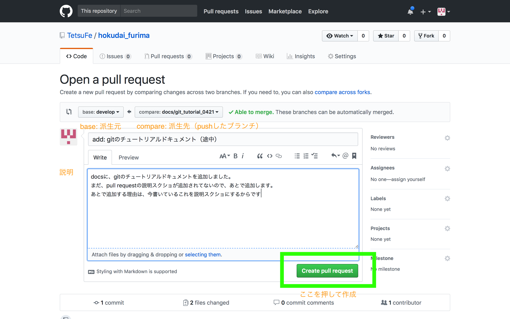

# pull requestを送る

## 1. pull requestとは
pull requestとは、簡単に言うと、「こんな感じでコード変更したけどどうですか？」というリクエストです。

自分の担当している部分のコードが完成したら、pull requestを送りましょう。

pull requestは他の開発者全員が見れるので、他の人にコードのレビューをしてもらうことができます。

pull requestで送ったコードは、レビューが終わったらブラウザ上のgithubの操作で統合できます。（統合は、gitではmerge（マージ）と呼びます）

## 2. pull requestを送ってみる
以下、このプロジェクト「北大フリマ」でのルールでのpull requestの送り方を説明します。一般的な方法とは少し違うところもあるかもしれません。

### 2.0.1 そもそもgitとは
gitに馴染みがない方のためにgitとは何か簡単に説明します。gitとgithubは違うので注意しましょう（後述）

gitとは、簡単に言うと、「ファイルの編集記録（差分）を行うツール」です。

ファイルの編集記録を行えると、例えば以下のことができます。

- 過去の編集記録をたどって、過去の状態（例えば、バグのない状態）に戻す
- Aさんの編集記録とBさんの編集記録を比べて、もし矛盾する部分があればそれを見つけて教えてくれる
- 誰がどこを変えたのか、githubなどの見やすいサービスで簡単にわかる

このようなことができるのがgitです。

また、gitでは以下の用語がよくでてきます、

- コミット: 編集記録(をつけること)
- ブランチ: 編集記録が分岐したもの(AさんのブランチA・BさんのブランチB)
- マージ: 分岐したAさんのブランチAとBさんのブランチBを統合すること

gitは、複数人で開発するとき、リモートリポジトリとローカルリポジトリにわかれます。

難しいことはありません。

- リモートリポジトリ: githubのサーバにあるコード
- ローカルリポジトリ: あなたのPC上にあるコード

基本の流れとしては、

- ローカルリポジトリ（各人のPC上のコード）で、新しくブランチを作る
- コードが書けたら、ブランチをリモートリポジトリにアップロード（push(プッシュ）)します
- そのブランチについてpull requestを送って、みんなでそのコードが大丈夫か確認します
- 大丈夫ならリモートリポジトリにマージ（統合）します
- （マージした内容をローカルリポジトリにダウンロード(pull(プル))します)

参考資料：[【連載】マンガでわかるGit まとめ](https://togetter.com/li/1038334)

### 2.0.2 gitの初期設定をする

#### 署名
編集記録には編集したユーザ名とメアドも記録されます。

このユーザ名やメアドを使ってgithub上で認証をするので、必ず設定する必要があります

```bash
$ git config --global user.name "ユーザ名" # (githubのユーザ名。""で囲む)
$ git config --global user.email githubのメアド # ""で囲まない
```

#### 諸設定
```bash
$ git config --global push.default matching  # git push としたとき、ローカルとリモートで同じ名前のブランチがあったら、全て push する。
```

#### ショートカット
```bash
$ git config --global alias.co checkout #任意。checkoutをcoと短縮系で使えるようになる。 git co = git checkout になる
```

### 2-1. 自分のブランチを知る
ここから、実際にpull requestを送る手順を説明します。

まずは、ブランチを作ります。ブランチは、過去の編集記録が連続した幹から分岐させた枝というイメージです。

実は、すでにあなたは何らかのブランチ上にいます。まずは自分が今どこのブランチにいるか確認しましょう。

```bash
$ git branch # 全てのローカルにあるブランチを表示`
```

```
* master
```

`*`が今いるブランチになります。この例の場合、あなたがいるブランチは「master」になります

**「北大フリマ」では、基本的にmasterブランチから、新しい派生ブランチを作っていくことになります。**（興味がある人は、[GitHub flow](https://gist.github.com/Gab-km/3705015)も見てください）


### 2-2. 新しいブランチをつくる
新しいブランチを作るには、以下のようにする。


```bash
$ git checkout -b ブランチ名(追加する機能などの名前) # $ ブランチ名の例：feature/notification_page, add_button_color_css）
```

このとき、元のブランチから「派生した」ブランチが作成されます。（今回の場合、masterから派生した）

ブランチを作成したら、確認しましょう。

```bash
$ git branch
```

```
* さっき追加したブランチ
  master
```

となっていればOK。

「北大フリマ」の場合、ブランチは、以下のような形で作成していきましょう。

- master
    - ブランチA（masterブランチから派生）
    - ブランチB（masterブランチから派生）

気をつけることは一つだけです。

ブランチを作成する前に、 `$ git branch` して、**自分のブランチがmasterであることを確認すればいいだけです。**


### 2.3 コードを編集する
適当にコードを編集しましょう。

**ここで、あなたが `$ git stash -u` を行っていた場合、コードを編集する前に、`$ git stash pop` をしましょう。先ほど退避しておいたファイルの変更が復活します。**

### 2.4 コミットする
コードを編集したら、その編集履歴を記録しましょう。編集履歴そのものや、編集履歴を記録することをコミットといいます。

編集したファイルの確認

```bash
$ git status # メッセージの意味がわからなかったらググる！
```

```bash
$ git add ファイル名 # もしくは、git add -A など
$ git commit -m "コミットメッセージ" # e.g: git commit -m "add: oo機能を追加"
```

これで、編集履歴の記録ができました！

コミットできているかの確認

```bash
$ git status # メッセージの意味がわからなかったらググる！
```

### 2.5 プッシュ
pushは、ローカル（自分のPC）のブランチをリモートのリポジトリに反映する操作です。

```bash
$ git push origin 現在のブランチ名
```

**基本的に、他の人に迷惑をかける可能性がわずかにあるのはこの操作(git push)だけです。が、基本的にちょっとミスしたくらいでは問題ありません。**

これで、やっとpull requestを送ることができます！


### 2.6 pull requestを送る
github上で、pull requestを送ります。

[https://github.com/tetsufe/hokudai_furima/pulls](https://github.com/tetsufe/hokudai_furima/pulls)から、「new pull request」を押して、そこから作成します。

- base: 派生元ブランチA(基本はmaster）
- compare: pushしたブランチ（派生先ブランチB）

という形でpull requestを送る



派生元のブランチと、pushした変更後のブランチで違いを見て、問題がないかサイト上で確認ができます。


これで pull request の作成ができるようになりました！


### 2.6.2 pull requestを送ったら？　レビューを待とう
pull requestを送ったら、pull requestのコメント欄に@tetsufeと書きましょう。

コードレビューをします。レビューが終わったら@tetsufeがマージします！


### 2.7 ２回目以降のpull request
これであなたはpull requestを無事、送ることができたと思います。

最初はやることが多かったですが、これからは以下の手順でpull requestを遅れます。

- 作業内容をだいたい決める
- `$ git status`で編集中かつ未コミットのファイルがないか確認。なければ次に進む
    - ある場合はコミットするか、`$ git stash # 場合によっては$ git stash -u` などで一時退避
- `$ git co master`
- `$ git branch`でmasterにいることを確認
    - もしくは過去の作業ブランチの続きをやる場合はそのブランチでもよい
- `$ git pull origin master` # リモートのorigin/masterブランチのコミットを今の作業ブランチ(master)にマージする
- `$ git checkout -b 新しいブランチ名`
- ファイル編集
- `$ git add -A # または $ git add 編集したファイル`
- `$ git commit -m "メッセージ"`
- `$ git push origin 現在のブランチ名`
- pull requestを送る


### 2.8 人のpull requestをテストする
- リモートのブランチ一覧を調べる

```bash
$ git branch -r
```

- ブランチをローカルにもってくる

```bash
$ git fetch
```

```bash
$ git checkout -b 新しいブランチ名 origin/もってきたいブランチ名
```

後は自分の環境で、pull requestされたコードが正しいかテストする

### 2.9 pull requestからマージ（統合）
githubのpull request上でマージ（統合）できます。

問題がなければここからマージします。

ここはとりあえず知ってなくても大丈夫です。


### まとめ
- git: 編集記録を管理するツール
- gitの用語
    - コミット: 編集記録(をつけること)
    - ブランチ: 編集記録が分岐したもの(AさんのブランチA・BさんのブランチB)
    - マージ: 分岐したAさんのブランチAとBさんのブランチBを統合すること
    - プッシュ: リモートリポジトリにコードと編集記録をアップロードすること
    - リモートリポジトリ: githubのサーバにあるコード
    - ローカルリポジトリ: あなたのPC上にあるコード
- 注意すべきこと
    - 「北大フリマ」では、基本的にmasterから派生したブランチで作業すること
        - `$ git branch`で自分がmasterにいることを確認してから`$ git checkout -b 新しいブランチ名`で新しいブランチを作る
    - pull requestのbaseはmasterを指定する
