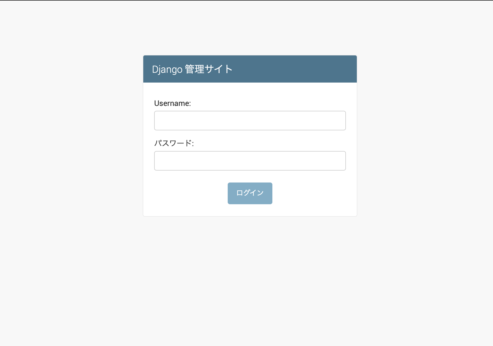
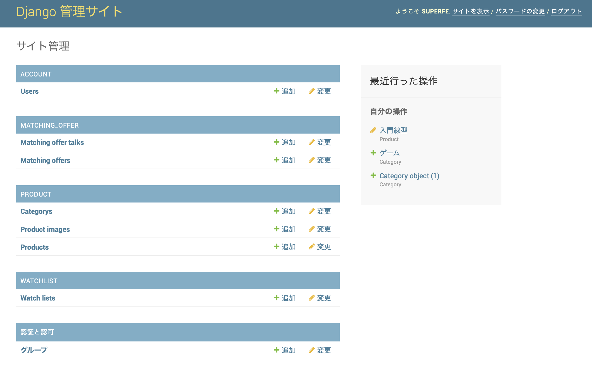
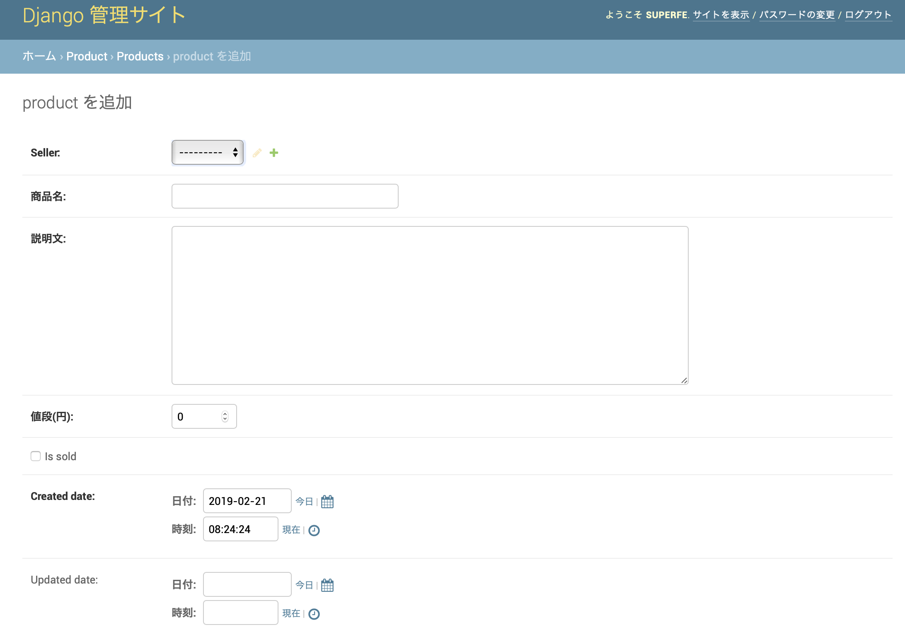

# 管理画面の使い方
Djangoでは標準の機能として「管理画面」の機能がついています。（ちなみにRailsとかには標準ではついていません）

非常に強力で便利な機能なのでぜひ使いましょう。実際のページを操作せずにデータを追加・編集・削除できるのでかなり便利で開発効率がめちゃくちゃ変わります。

## 管理画面とは
管理画面とは、簡単にいうとデータベースを操作できる画面です。

主に以下の４種類の操作ができます。（用語は覚えなくても使えます）

- C: Create（新規作成）
- R: Read（見る）
- U: Update（一部の情報を更新）
- D: Delete（削除）


## スーパーユーザ作成
誰でも管理画面にアクセスできてはいけないので、管理画面にアクセスできるユーザを作成します。このようなユーザのことをスーパーユーザと言います。

これは開発者のターミナル（端末・コマンドプロンプトなど）で作ることができます。
普通のサインアップページからは作成できないので注意しましょう。

まずはスーパーユーザを作ってみましょう。

$ python manage.py createsuperuser


## ログイン
作ったスーパーユーザで管理画面にログインしましょう。

ここからはブラウザを操作しましょう。localhost:ポート番号/admin にアクセスして、先ほど作成したスーパーユーザのIDとパスワードを入力すれば、管理画面にログインできます！



（＊ポート番号について：Djangoでは、$ python manage.py runserver したときにポート番号を決めます。デフォは8000番。$ python manage.py runserver -p 3000 と打てば指定できる。この場合、localhost:3000/admin のようにアクセスします）


## 管理画面を操作する
適当にやってれば感覚が掴めます。

以下のように、新しいデータを追加したり、編集できたりします。便利！





## 管理画面で操作できるモデルとできないモデル
管理画面で操作できるモデルとできないモデルがあります。

管理画面で操作できるモデルは、以下のように設定してあります。

`hokudai_furima/account/admin.py`

```py
from django.contrib import admin
from .models import User

admin.site.register(User)
```


